# 🏦  Agentic Banking App with SQL in Fabric

#### NOTE: The main branch was last updated on: 🟢2025-12-30🟢

**Agentic Banking App** is an interactive web application designed to simulate a modern banking dashboard. Its primary purpose is to serve as an educational tool, demonstrating:
- How SQL-based databases are leveraged across different types of workloads: **OLTP**, **OLAP**, **AI** workloads.
- How agile **AI-driven analysis and insight discovery** can be enabled via prescriptive data models in Fabric.
- How easy it is possible to **integrate other Fabric workloads** (e.g., Report, Data Agent, Notebook) leveraging that data model.

Through a hands-on interface, users can see the practical difference between writing a new transaction to the database, running complex analytical queries on historical data, and using natural language to ask an agent to query the database for them.

**Test the live app here:** https://aka.ms/HostedAgenticAppFabric
---

## ✨ Features

### Banking Application


**The Banking Dashboard**: A central hub to view account balance and navigate the application. Below are the core capabilities:
- **Transactions (OLTP)**: View a real-time list of all past transactions. This demonstrates a typical high-volume, read-heavy OLTP workload.
- **Money Transfer (OLTP)**: Perform transfers between accounts. This showcases a classic atomic, write-heavy OLTP operation that must be fast and reliable.
- **Financial Analytics (OLAP)**: Explore an analytics dashboard with charts and summaries of spending habits. This represents an OLAP workload, running complex, aggregate queries over a large dataset.
- **Generative UI**: User can ask for a personalized interactive visualization/simulations to be created on the fly! The custom visualizaton will be generated via an expert agent, and the relevant configuration will be saved in the database for that user profile so that it can be retrieved every time this user logs in. Generated visualizations can also be edited upon user request.

### How it works:
- **Multi-Agent Workload**: The app is built on top of a multi-agent solution in Langgraph. There are four distinct agents:
    1. **Coordinator agent**: this agent is responsible for assessing user request and passing it to the relevant specialized agent,
    2. **Support agent**: this agent is specialized in answering general customer service questions via RAG.
    3. **Account agent**: this agent is a banking operations specialist that can respond to common banking requests such as getting account balance/transactioon summary, creating a new account, making transactions from one account to another, etc.
    4. **Visualization agent**: this agent is responsible for creating custom visualizations and simulations for the user.
- Scenarios to test:
    - Ask questions about your finances in plain English (e.g., "How much did I spend on groceries last month?"). An AI agent translates your question into a SQL query, executes it, and returns the answer.
    - Get customer support from using RAG over documents
    - Open new account, transfer money in plain English through an action oriented data agent.
    - Ask for custom visualizations to be generated for a more personalized UI experience. 

### Agent Analytics Service
- A separate service which is run to capture, in near-real-time, the operational data generated by the agentic solution and store it to a Fabric SQL database via a prescribed data model.
- This service also streams in real-time the content safety data per response to Fabric Eventstream, from which it will also stores this data into a KQL database in Fabric Eventhouse which can the be used for real-time monitoring and alerting.

### Agentic app insights and analytics in Fabric

- As the app is used, the agentic operational data is captured, modeled, and used to reflect valuable analytics and insights via Fabric features such as Power BI reports, data agent, notebooks, real-time dashboards, etc.
---

## 🛠️ Tech Stack

| Layer    | Technology                            |
| -------- | ------------------------------------- |
| Frontend | React, Vite, TypeScript, Tailwind CSS |
| Backend  | Python, Flask, LangChain, LangGraph   |
| Database | Fabric SQL Database                   |
| Eventstream | Fabric Eventhouse, KQL Database
| AI       | Azure OpenAI API                      |

---

## Demo: Setting up SQL Agentic Application on Microsoft Fabric

[](https://www.youtube.com/watch?v=F4IMijKm990)


## 🔧 Prerequisites

- [Node.js](https://nodejs.org/) (v18 or later)
- [Python](https://www.python.org/) (3.11.9 or higher)
- A Fabric workspace 
- An [Azure OpenAI API Key](https://azure.microsoft.com/en-us/products/ai-services/openai-service)
- ODBC Driver for SQL Server 18
- Recommend VSCode as tested in VS Code only
- This demo runs currently only on a **Windows Machine** as it support ActiveDirectoryInteractive

---

## Set up required resources (One time)

### 1. Set up your repo
- Clone this repo: navigate to the repository on GitHub and click the "Code" button. Copy the URL provided for cloning.
- Open a terminal window on your machine and run below:

```bash
git clone https://github.com/Azure-Samples/sql-agentic-app-with-fabric.git
cd sql-agentic-app-with-fabric  # root folder of the repo
```
- Create a **private** repo in your Github account, with the same name. Since you will be adding sensitive credentials, **repo must be private**.
- Go back to terminal (you should be in the root folder of the repo you cloned) and push the content to your private repo by running below:

```bash
 git push https://github.com/[replace with you git username]/[replace with your repo name].git
```
### 2. Set up your Fabric account

- If you do not already have access to a Fabric capacity, you can easily enable a Microsoft Fabric trial capacity for free which will give you free access for 60 days to all features needed for this demo: https://learn.microsoft.com/en-us/fabric/fundamentals/fabric-trial

- In Home tab of your Fabric account (with Welcome to Fabric title), click on "New workspace" and proceed to create your workspace for this demo.

### 3. Automatic set up of all required Fabric resources and artifacts 
To easily set up your Fabric workspace with all required artifacts for this demo, you need to link your Fabric workspace with your repo. 

You only need to do below steps one time.

#### Step 1: Set up your database in Fabric

1. In Fabric, go to your workspace and click on "Workspace settings" on top right of the page.
2. Go to Git integration tab -> Click on GitHub tile and click on "Add account"
3. Choose a name, paste your fine grained personal access token for the private repo you just created (don't know how to generate this? there are a lot of tutorials online such as: https://thetechdarts.com/generate-personal-access-token-in-github/)
4. paste the repo url and connect
5. After connecting to the repo, you will see the option in the same tab to provide the branch and folder name. Branch should be "main" and folder name should be "Fabric_artifacts"
    - Click on "Connect and Sync" 
    - Now the process of pulling all Fabric artifacts from the repo to your workspace starts. This may take a few minutes. Wait until all is done (you will see green check marks)
    
#### Step 2: Re-deploy to connect semantic model to the right database endpoint

- In the first step, data artifacts were deployed, but the semantic model needs to be redeloyed by provding the correct database endpoint parameters which you would need to obtain and provide manually as below:
1. Obtain below values from Fabric (copy and keep somewhere)
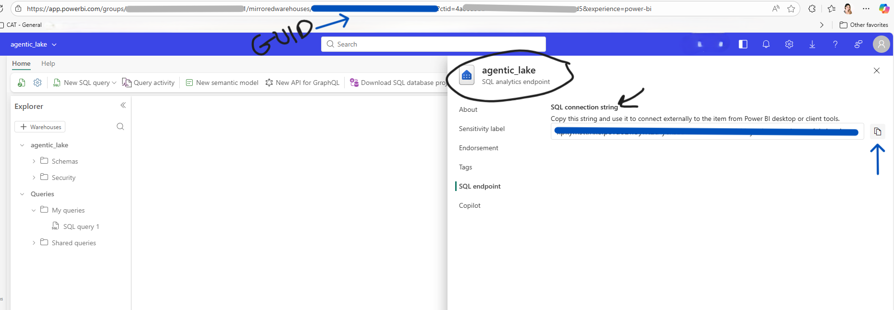
    - **SQL server connection string**: First, go to the **SQL analytics endpoint** of the **agentic_lake**, go to settings -> SQL endpoint -> copy value under SQL connection string  (paste it somewhere to keep it for now)
    - **Lakehouse analytics GUID**: Look at the address bar, you should see something like this: *https://app.fabric.microsoft.com/groups/[first string]/mirroredwarehouses (or lakehouses)/**[second string]**?experience=fabric-developer*
        - copy the value you see in position of second string. 
        

2. Now in your private Git repo, go to: **Fabric_artifacts\banking_semantic_model.SemanticModel\definition**, open the file called **expressions.tmdl** and replace the values with the ones you just retrieved. *Save the file and commit/push it to your repo*.
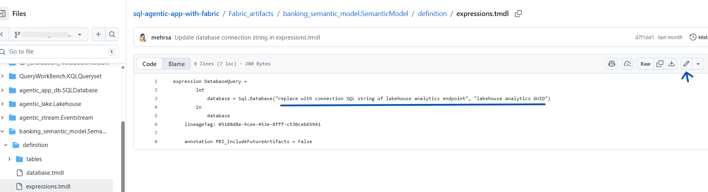

3. Now go back to your Fabric workspace and trigger an update via Source Control

4. This will start to set up the connection between lakehouse's SQL analytics endpoint and the semantic model and  may take 1-2 minutes. Below shows how your data lineage view should look like after this is done. 

    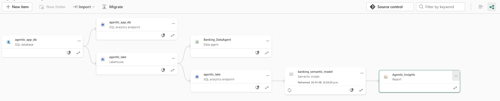

### 4. Add extra views to Lakehouse's SQL analytics endpoint

The initial application data will be automatically populated, if not existing, in the SQL Database when you start the backend application. So you do not need to do any extra steps to ingest data. But for the Power BI reporting layer, we need to add some extra views.

**Add views to the SQL Analytics endpoint**
- Go to the **SQL analytics** endpoint of your **agentic_lake**:

    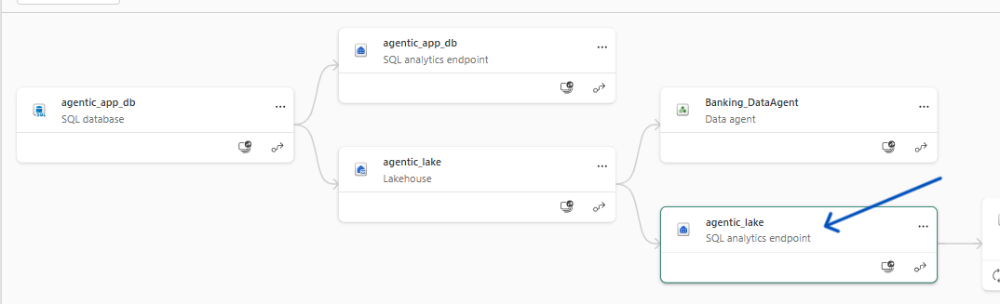
- Go to **Data_Ingest** folder and run all 3 queries that you see in file **views.sql**:

    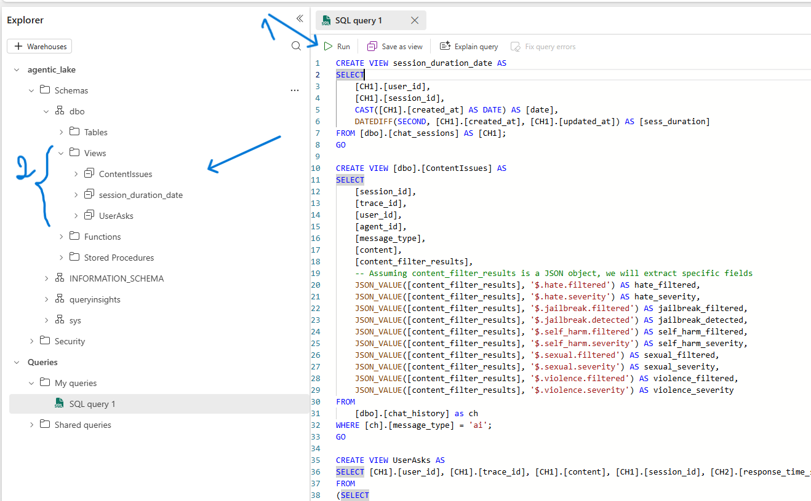

## Follow below steps to run the app locally!
Now that all resources are set up, follow below steps to run and test the app:
### 1. Configure Environment Variables

Before running the application, you need to configure your environment variables. This file stores all the secret keys and connection strings your application needs to connect to Azure and Microsoft Fabric resources.

Rename the sample file: In the backend directory, find the file named **.env.sample** make a copy of it and rename it to **.env**.

Edit the variables: Open the new .env file and fill in the values for the following variables:

**Microsoft Fabric SQL Databases**

**FABRIC_SQL_CONNECTION_URL_AGENTIC**: This is the connection string for the SQL Database that contains both **the agentic application's operational data** (e.g., chat history) and **the sample customer banking data**. You can find this in your Fabric workspace by navigating to the SQL-endpoint of this database, clicking the "settings" -> "Connection strings" -> go to "ODBC" tab and select and copy SQL connection string.

**Microsoft Fabric Eventhub Connection**

There are two variables in .env file that you need to populate to successfully send real-time app usage logs to your Fabric EventHub: **FABRIC_EVENT_HUB_CONNECTION_STRING** and **FABRIC_EVENT_HUB_NAME**

In your Fabric workspace, open your Eventstream:

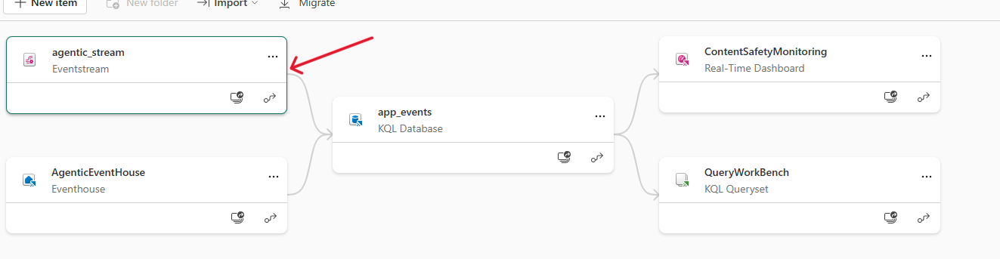

Click on "CustomEndpoint" block, then click on "SAS Key Authentication" tab as shown below: 

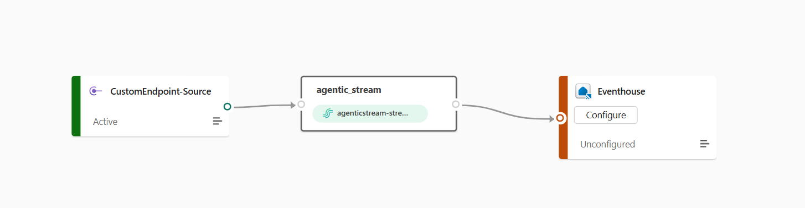

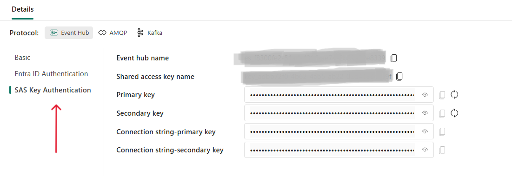

Lastly, copy the value shown for "Event hub name" and paste it in the .env file as the **FABRIC_EVENT_HUB_NAME** value. Then, first click on the eye button near "Connection string-primary key", then copy the value. Paste this as the value for **FABRIC_EVENT_HUB_CONNECTION_STRING** in your .env file.

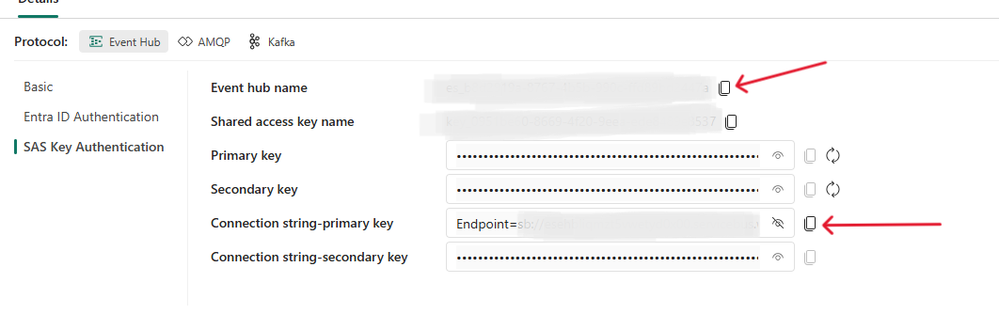

**Azure OpenAI Services**

**AZURE_OPENAI_KEY**: Your API key for the Azure OpenAI service. You can find this in the Azure Portal by navigating to your Azure OpenAI resource and selecting Keys and Endpoint.

**AZURE_OPENAI_ENDPOINT**: The endpoint URL for your Azure OpenAI service. This is found on the same Keys and Endpoint page in the Azure Portal.

**AZURE_OPENAI_DEPLOYMENT**: The name of your chat model deployment (e.g., "gpt-5-mini"). This is the custom name you gave the model when you deployed it in Azure OpenAI Studio.

**AZURE_OPENAI_EMBEDDING_DEPLOYMENT**: text-embedding-ada-002 
- -> **NOTE: you have to have text-embedding-ada-002 deployed for this demo since embeddings were generated using this model**

### 2. Install Backend Requirements (Flask API)
In the root project directory run below commands:

```bash
python3 -m venv venv # this creates the environment
.\venv\Scripts\activate # (on Windows)  -- this Activates the environment
pip install -r requirements.txt
```

---

### 3. Configure the Frontend (React + Vite)

From the root project directory:

```bash
npm install
```

---

### 4. Run the Application

Open **two** terminal windows.

#### Terminal 1: Start Backend

From backend folder, run below in terminal (**ensure you have your virtual environment activated for this!**  )

```bash
python launcher.py
```
This will launch two services:
1. Banking service on: [http://127.0.0.1:5001](http://127.0.0.1:5001)
2. Agent analytics service on: [http://127.0.0.1:5002](http://127.0.0.1:5002)

**You will be prompted for your Fabric credentials during this so watch out for window pop ups and in taskbar!**

#### Terminal 2: Start Frontend

Ensure you are in the root of your folder and run below:

```bash
npm run dev
```

Frontend will run on: [http://localhost:5173](http://localhost:5173)

---
## Testing Real-time Monitoring

During the app set up process, we already deployed all required Fabric artifacts, including the ones to enable streaming and storing real-time app usage logs. 

While almost all is in place, there are still a few steps remaining to fully set up the end to end process of streaming data and enabling the real-time dashboard for monitoring purposes. 

### Follow below steps to finalize real-time intelligence pipeline in Fabric

#### Connect your Eventhouse database to the Eventstream

1. **Ensure you have done at least one test run with the application.** This enables the streaming pipeline to recognize and map the schema of incoming streaming data.
2. In your Fabric workspace, open your Eventstream artifact. 

    
3. Click on agentic_stream object, click on refresh and ensure there is at least one data entry:
    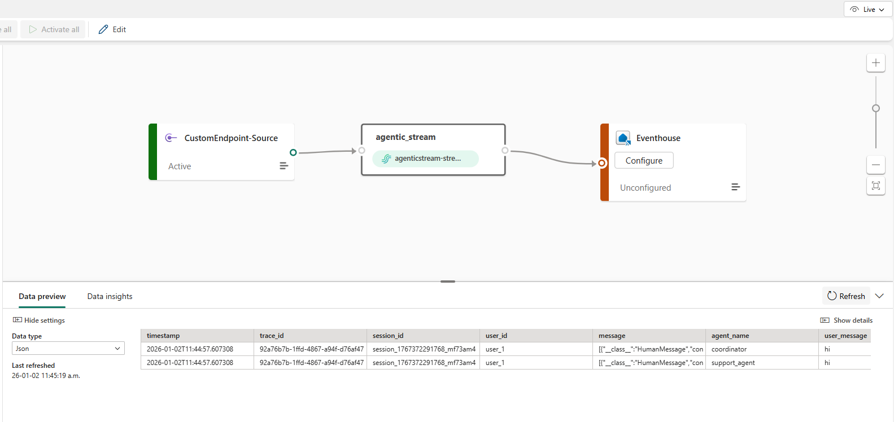
As you can see in above image, EventHouse is shown as "Unconfigured". Click on "Configure", and follow steps as shown in below images:

    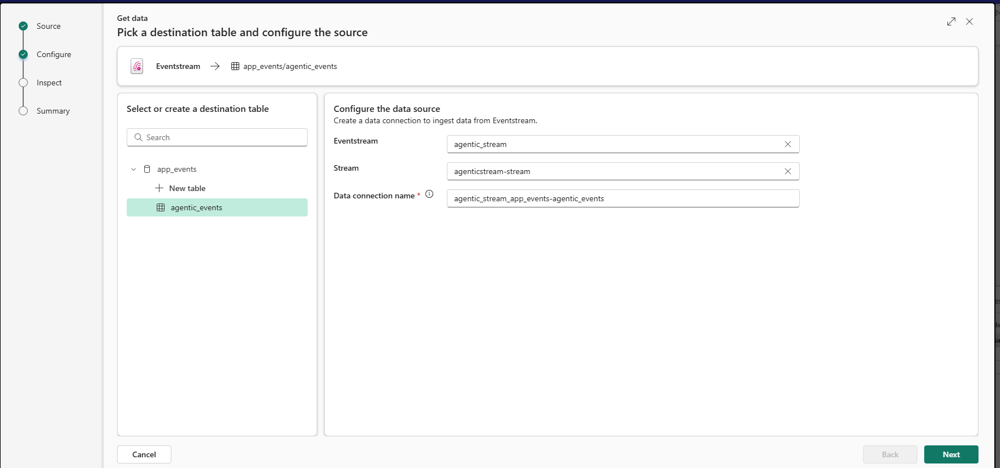
    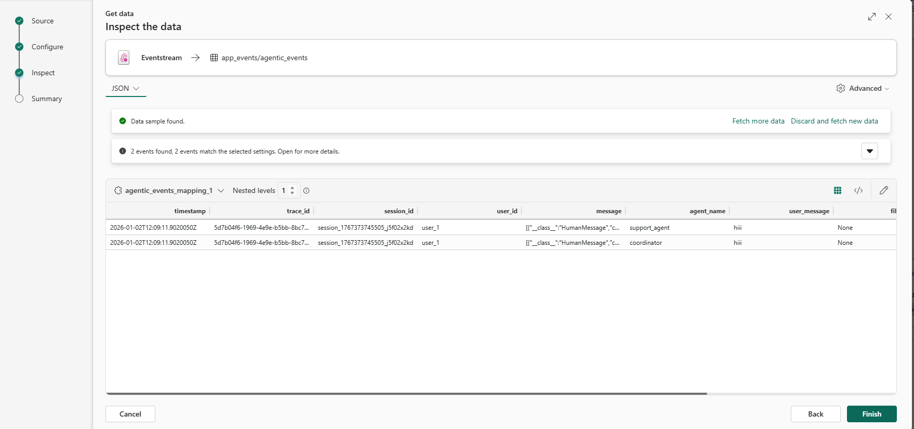
    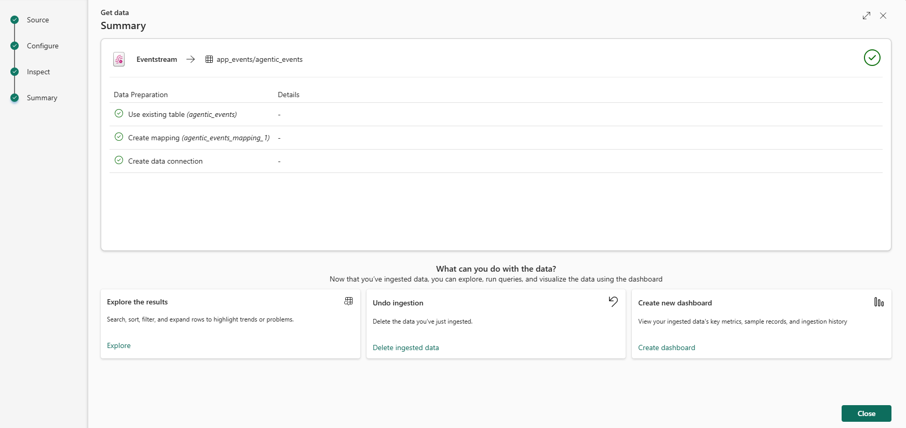

4. After Clicking in "Close" in the last step, you willbe back at your EventStream pipeline view. Click on "Edit" on upper right side, then click on "Publish".

    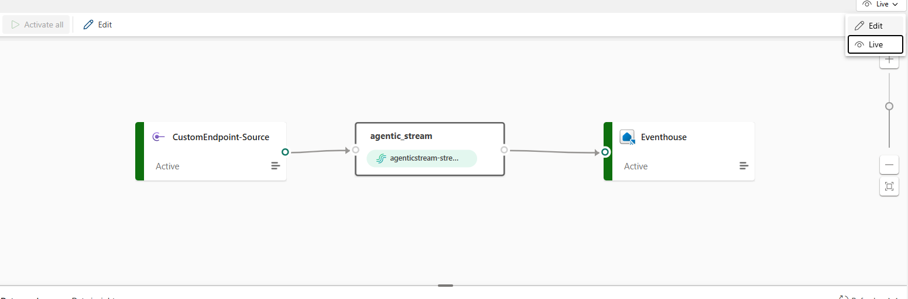
    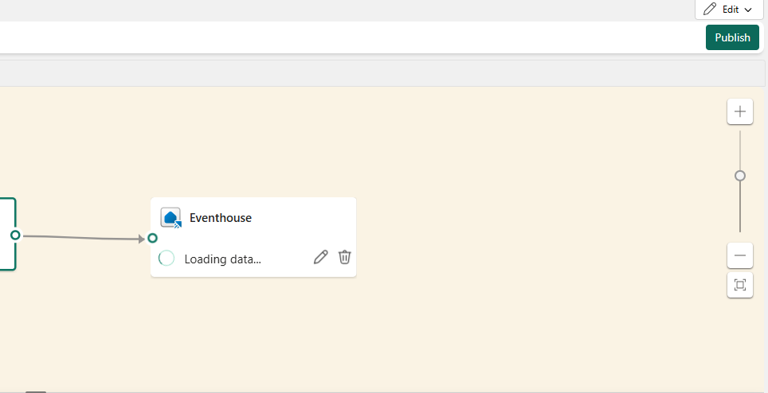

5. Now to test, run the app and perform a test chat. Then go back to your workspace and open the "app_events" KQL database (middle block). It may take a few minutes and do some refresh for the first time after publishing the changes to start seeing the event data in your database, but it should look like below:
    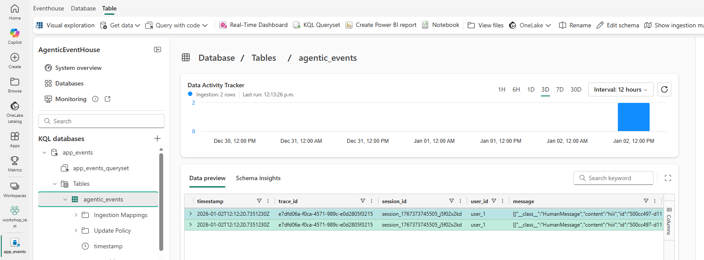

6. Go back to your workspace view, and now open the "QueryWorkBench" block. We will be using the workbench to write queries for adding to the Real-Time Dashboard. As you can see there are already some example query blocks that you can choose and run. 
    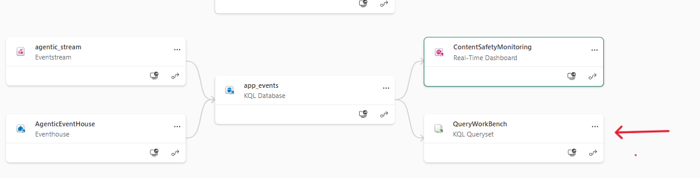
    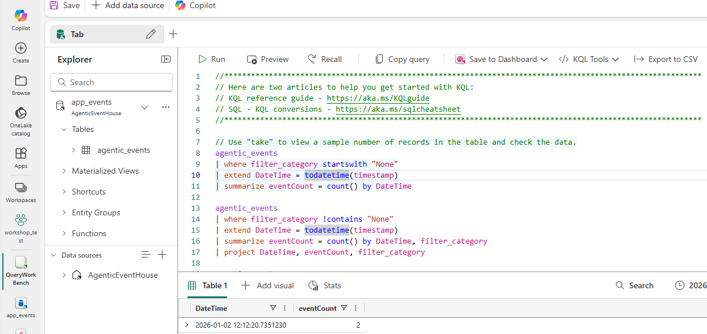


#### Add content safety views to the Real-Time Dashboard

In this example exercise, we will be adding the queries to the existing "ContentSafetyMonitoring" dashboard. Below is the initial view you already have which has two blocks, one showing all events per categpory, and the other showing contents that got blocked due to self_harm filter:

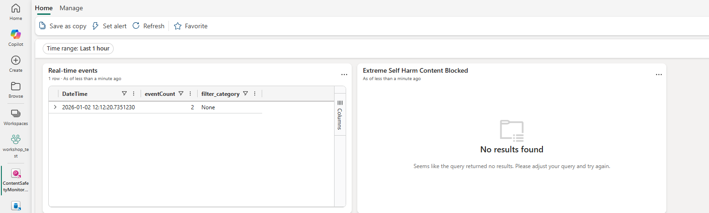

Adding new views to dashboard is easy. Just click on any query block in your QueryWorkBench, and add it as a view to the existing ContentSafetyMonitoring dashboard as shown below: 

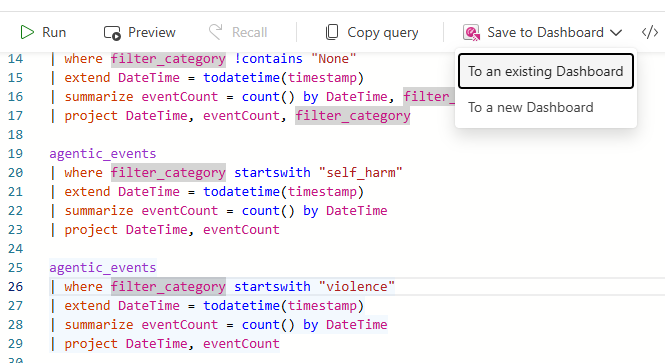

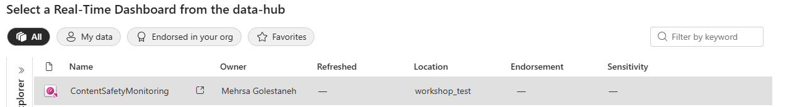

When a new view is added, it will look something like below:

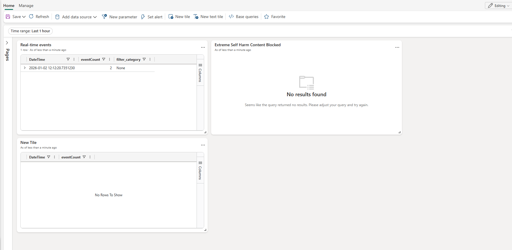


You can edit the name, visualization type, etc. by going to the edit mode, make your changes and then apply them:

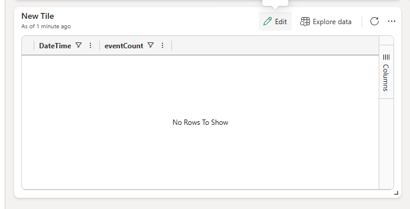

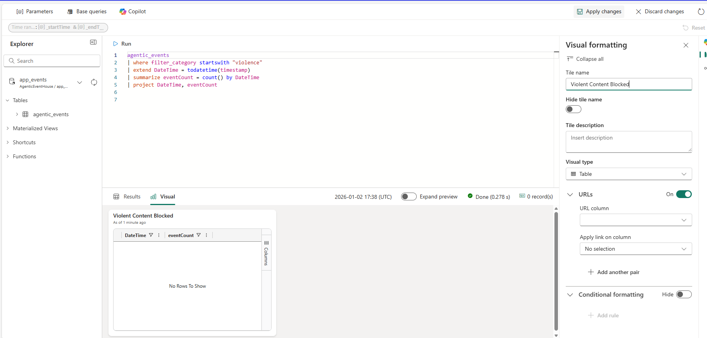


Add all queries to the dashboard. Also feel free to write new queries for other scenarios. 

In the application, we have built in an easy way to mimic sensitive content message log without actually getting blocked by the OpenAI api. To test, when chatting you can simply reply with your desired filter category (ex. violence, jailbreak, etc.).

## Explore Agentic Analytics

As you use the app:

- The operational data is being stored in the agentic_app_db Fabric SQL database
- Agentic_lake lakehouse gets updated
- The data model captured via banking_semantic_model is refreshed
- Agentic_Insights report gets updated based on most recent data


## Explore how to create and Ingest Embeddings from PDF (optional)
We automatically ingested embeddings to ensure a quick onboarding. If you are interested to see how to do it, we have provided a python script:

1. Copy the .env file in the folder **Data_Ingest**.
2. Open the Python script in the path: Data_Ingest/Ingest_pdf.py
3. Run the script from the folder Data_Ingest (note that doing so might duplicate the same embeddings):
```bash
python Ingest_pdf.py
```
---
## Evaluate agent performance via Azure Evaluation Framework (Optional)

As part of Fabric artifacts, we have included a notebook (QA_Evaluation_Notebook) that computes four scores (intent resolution, relevance, coherence and fluency) reflecting the agent's performance when answsering user requests. These scores are calculated based on Question/Answer pairs using [Azure AI Evaluation](https://learn.microsoft.com/en-us/azure/ai-foundry/how-to/develop/agent-evaluate-sdk)
You can set up this notebook in your Fabric workspace and run by following below steps:
1. Open the notebook item, on the left side, under **Explorer -> Data items** click on **"+ Add data items" -> "Existing Data Sources"** and choose the agentic_lake. Now your notebook is connected to the correct data source
2. Last step is to provide environment variables required to connect to your **llm model** of choice to be used as the judge. Create a .env file as below and upload it to the **Files** (located under the Tables) in your notebook page:

    ``` 
    AZURE_OPENAI_KEY="your key"
    AZURE_OPENAI_ENDPOINT="your model endpoint"
    AZURE_OPENAI_DEPLOYMENT="model name"
    AZURE_OPENAI_API_VERSION="api version"
    ```
3. Now you can run the cells in the notebook in order. After all is run successfully there should be a new table created in the "agentic_lake" called **answerqualityscores_withcontext** which has all the scores.

##  Contributing

Contributions are welcome!
If you have suggestions for improvements or find any bugs, feel free to [open an issue](https://aka.ms/AgenticAppFabric) or submit a pull request.