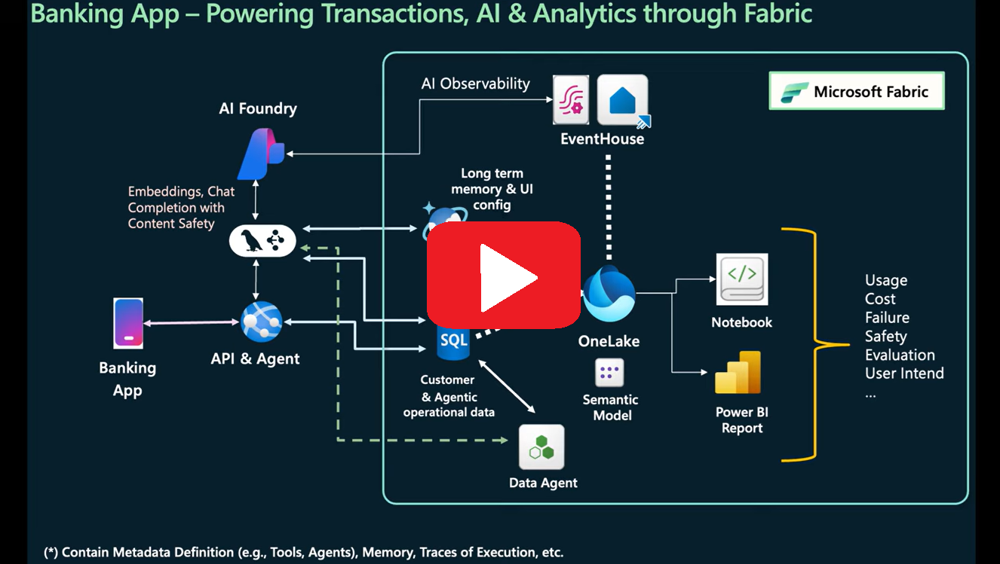
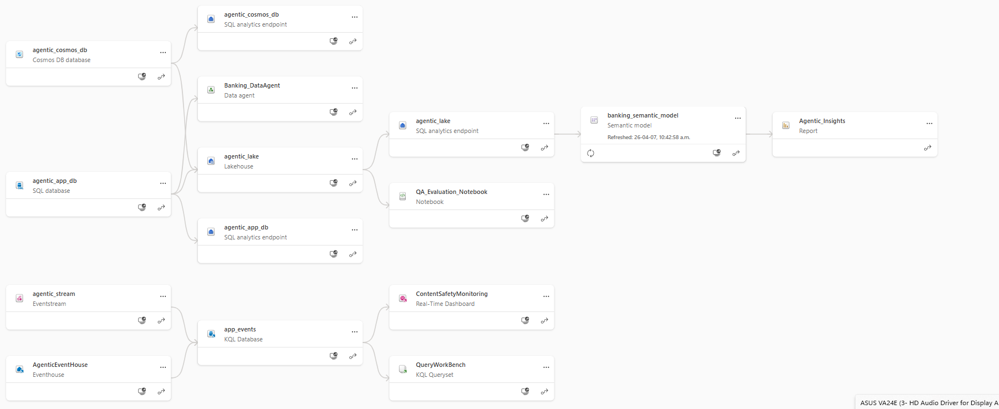

# 🏦 Agentic Banking App with Microsoft Fabric

> Last updated: 🟢 2026-04-08 🟢

An interactive banking demo that shows how databases power **OLTP**, **OLAP**, and **AI workloads** side-by-side, all wired together through Microsoft Fabric.

🚀 [**Try the live app**](https://aka.ms/HostedAgenticAppFabric)

---

## Table of Contents

| | |
|---|---|
| 🚀 [Setup Guide](#-setup-guide) | Get the app running locally |
| ⚗️ [Explore Fabric Workloads](docs/EXPLORE.md) | RTI, Power BI, Data Agent walkthroughs |
| 🧑‍💻 [Learn More](docs/LEARN.md) | Architecture, agents, embeddings, contributing |

---

## What This App Does

- **Transactions (OLTP)** — real-time writes and reads against a Fabric SQL Database
- **Analytics (OLAP)** — an analytics dashboard with charts and summaries of spending habits. This represents an OLAP workload, running complex, aggregate queries over a large dataset.
- **AI Agents** — multi-agent LangGraph system with a coordinator, support, account, Fabric Data Agent (optional), and visualization agent
- **Generative UI** — agents create personalized interactive visualizations on the fly
- **Real-time Monitoring** — app usage and content safety data streamed to Fabric Eventhouse via Eventstream

---

## 🚀 Setup Guide

### Prerequisites

Before you begin, make sure you have the following:

| Requirement | Notes |
|---|---|
| [VS Code](https://code.visualstudio.com/) | Recommended; tested environment |
| [Dev Containers extension](https://marketplace.visualstudio.com/items?itemName=ms-vscode-remote.remote-containers) | Required to use the included Dev Container in VS Code |
| Docker Desktop / Docker Engine | Required to use the included Dev Container |
| [Node.js](https://nodejs.org/) v18+ | Frontend. Skip this install when using the Dev Container; it already includes Node.js 20.19.0 |
| [Python](https://www.python.org/) 3.11.9+ | Backend. Skip this install when using the Dev Container; it already includes Python 3.11 |
| [Azure CLI](https://learn.microsoft.com/en-us/cli/azure/install-azure-cli) | Auth. Skip this install when using the Dev Container; it already includes Azure CLI. [Windows](https://learn.microsoft.com/en-us/cli/azure/install-azure-cli-windows) · [macOS](https://learn.microsoft.com/en-us/cli/azure/install-azure-cli-macos) |
| [ODBC Driver 18 for SQL Server](https://learn.microsoft.com/en-us/sql/connect/odbc/download-odbc-driver-for-sql-server) | Database connectivity. Skip this install when using the Dev Container; it already includes ODBC Driver 18 |
| Microsoft Fabric capacity | [Start a free 60-day trial](https://learn.microsoft.com/en-us/fabric/fundamentals/fabric-trial) if needed |
| Azure OpenAI resource | [Create one in Azure Portal](https://azure.microsoft.com/en-us/products/ai-services/openai-service) |

> **Recommended:** VS Code (tested environment)

> **Using the included VS Code Dev Container?** After cloning the repo, open this folder in VS Code and run `Dev Containers: Reopen in Container`. During container setup, `.devcontainer/post-create.sh` creates `.venv`, runs `pip install -r requirements.txt` when `requirements.txt` changes, runs `npm install`, copies `backend/.env.sample` to `backend/.env` if needed, and the container forwards ports `5173`, `5001`, and `5002`.

> The Dev Container also installs these VS Code extensions automatically: Python, Pylance, ESLint, Prettier, Tailwind CSS, Docker, and Azure Account. Continue with Step 4 after the container setup finishes. 
IF YOU ARE USING DEV CONTAINERS DO NOT PERFORM `pip install` and `npm install`

---

### Quick Setup Video

[](https://youtu.be/svxQccXyreM)
---

### Step 1 — Clone the Repo

```bash
git clone https://github.com/Azure-Samples/agentic-app-with-fabric.git
cd agentic-app-with-fabric
```

If you are using the Dev Container, open this folder in VS Code and run `Dev Containers: Reopen in Container`. After the container setup finishes, continue with Step 4.

---

### Step 2 — Install Python Dependencies

If you are using the Dev Container, skip this step. `.devcontainer/post-create.sh` already creates `.venv` and runs `pip install -r requirements.txt` automatically when `requirements.txt` changes.

```bash
# Create and activate a virtual environment
# Windows: 
python -m venv venv
.\venv\Scripts\activate

# macOS / Linux: 
python3 -m venv venv
source venv/bin/activate

# Install packages
pip install -r requirements.txt
```

---

### Step 3 — Install Frontend Dependencies

If you are using the Dev Container, skip this step. `.devcontainer/post-create.sh` already runs `npm install`.

```bash
npm install
```

---

### Step 4 — Log in to Azure

If you are using the Dev Container, run this in a VS Code terminal attached to the container.

```bash
az login
```

Use your Microsoft Fabric account credentials. Watch for browser pop-ups.

> ⚠️ You must repeat `az login` any time you restart the backend.

---

### Step 5 — Deploy the Fabric Workspace

This single command creates the workspace, deploys all Fabric artifacts, creates SQL tables, and populates `backend/.env` with connection strings automatically.

```bash
# Windows:
python scripts/setup_workspace.py --workspace-name "AgenticBankingApp-{yourinistials}"

# Mac:
python3 scripts/setup_workspace.py --workspace-name "AgenticBankingApp-{yourinistials}"
```

The script will prompt you to select a Fabric capacity, then create a workspace named **AgenticBankingApp-{yourinistials}**, or any other name to make the workspace name unique. 

**What gets deployed:**

| Artifact | Type |
|---|---|
| agentic_app_db | SQL Database |
| agentic_cosmos_db | Cosmos DB |
| agentic_lake | Lakehouse |
| banking_semantic_model | Semantic Model |
| Agentic_Insights | Power BI Report |
| Banking_DataAgent | Data Agent |
| agentic_eventhouse | Eventhouse + KQL Database |
| agentic_stream | Eventstream |
| ContentSafetyMonitoring | KQL Dashboard |
| QA_Evaluation_Notebook | Notebook |

> 💡 **Alternative deployment:** prefer Git integration? See [Deploy via Git Integration](git_integration_deployment.md).

---

### Step 6 — Finalize the Deployment

After `setup_workspace.py` completes, run:

```bash
# Windows:
python scripts/finalize_views_and_report.py

# Mac:
python3 scripts/finalize_views_and_report.py 
```

This finalizes the Lakehouse SQL views, patches the Semantic Model, and deploys the Power BI Report. The workspace ID is read automatically from the previous step — no argument needed.

When done, your workspace lineage should look like this:



---

### Step 7 — Configure Environment Variables

`setup_workspace.py` already auto-populated some of `backend/.env`. You only need to fill in the **Azure OpenAI** values, **Cosmos DB Endpoint** and **EventHub** connection details.

Open `backend/.env` and set (copy and rename .env.sample template file):

#### Azure OpenAI *(required)*

```dotenv
AZURE_OPENAI_KEY= Your API key for the Azure OpenAI service. You can find this in the Azure Portal by navigating to your Azure OpenAI resource and selecting Keys and Endpoint.
AZURE_OPENAI_ENDPOINT="https://<your-resource>.openai.azure.com/"
AZURE_OPENAI_DEPLOYMENT="<your chat model name, e.g. gpt-4o-mini>"
AZURE_OPENAI_EMBEDDING_DEPLOYMENT="text-embedding-ada-002"
```

> ⚠️ The embedding deployment **must** be `text-embedding-ada-002` — embeddings in the repo were generated with that model.

#### Microsoft Fabric Cosmos DB

```dotenv
COSMOS_DB_ENDPOINT= You can find this in your Fabric workspace by navigating to the Cosmos DB artifact in your workspace, clicking the "settings" -> "Connection" tab and copy the endpoint string.
```

#### EventHub Connection *(required for real-time monitoring)*

In your Fabric workspace, open the **agentic_stream** Eventstream → click **CustomEndpoint** → **SAS Key Authentication** tab:


Copy the two values into `.env`:

```dotenv
FABRIC_EVENT_HUB_NAME="<Event hub name>"
FABRIC_EVENT_HUB_PRIMARY_KEY="<Connection string-primary key>"
NOTE: first click on the eye button near "Connection string-primary key" to reveal the value, then copy the value
```

#### Auto-populated Variables *(no action needed)*

The following were written to `.env` automatically by the deployment script:

```dotenv
FABRIC_SQL_CONNECTION_URL_AGENTIC   # SQL Database connection string
FABRIC_DATA_AGENT_SERVER_URL        # Data Agent MCP endpoint
FABRIC_DATA_AGENT_TOOL_NAME         # Data Agent tool name
USE_FABRIC_DATA_AGENT               # Set to "true"
COSMOS_DB_DATABASE_NAME             # Set to "agentic_cosmos_db"
```

---

### Step 8 — Run the App

Open **two terminal windows** (both after `az login`; in the Dev Container, VS Code activates `.venv` automatically):

**Terminal 1 — Backend**

```bash
cd backend

# Windows
python launcher.py

# Mac
python3 launcher.py
```

Starts two services:
- Banking API → [http://127.0.0.1:5001](http://127.0.0.1:5001)
- Agent Analytics → [http://127.0.0.1:5002](http://127.0.0.1:5002)

**Terminal 2 — Frontend**

```bash
npm run dev
```

Opens the app at → [http://localhost:5173](http://localhost:5173)

If you are using the Dev Container, VS Code forwards ports `5173`, `5001`, and `5002` automatically when these services start.


---

## Next Steps

| | |
|---|---|
| ⚗️ [Explore Fabric Workloads](docs/EXPLORE.md) | Set up real-time monitoring, Power BI analytics, and the Data Agent |
| 🧑‍💻 [Learn More](docs/LEARN.md) | Understand the architecture, multi-agent design, and how to contribute |
