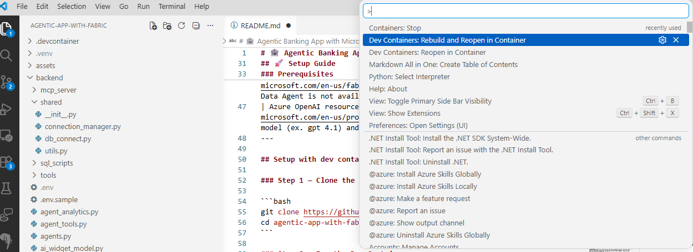
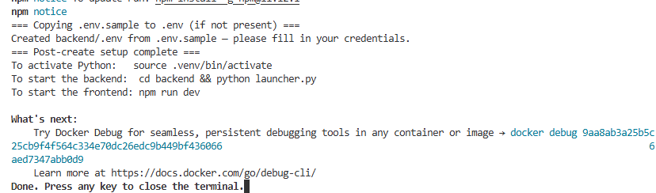
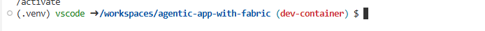
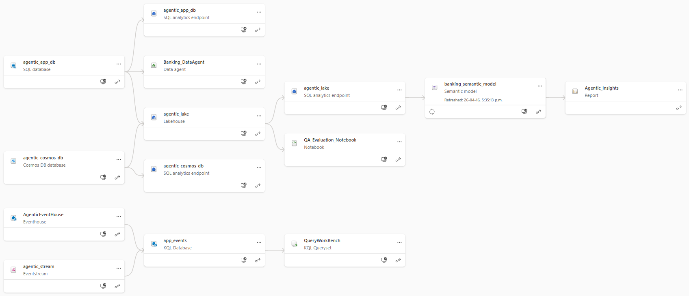

# 🏦 Agentic Banking App with Microsoft Fabric

> Last updated: 🟢 2026-04-27 🟢

An interactive banking demo that shows how databases power **OLTP**, **OLAP**, and **AI workloads** side-by-side, all wired together through Microsoft Fabric.

🚀 [**Try the live app**](https://aka.ms/HostedAgenticAppFabric)

---

## Table of Contents

| | |
|---|---|
| 🚀 [Setup Guide](#-setup-guide) | Get the app running locally |
| ⚗️ [Explore Fabric Workloads](docs/EXPLORE.md) | RTI, Power BI, Data Agent walkthroughs |
| 🧑‍💻 [Learn More & Contribute!](docs/LEARN.md) | Architecture, agents, embeddings, contributing |

---

## What This App Does

- **Transactions (OLTP)** — real-time writes and reads against a Fabric SQL Database
- **Analytics (OLAP)** — an analytics dashboard with charts and summaries of spending habits. This represents an OLAP workload, running complex, aggregate queries over a large dataset.
- **AI Agents** — multi-agent LangGraph system with a coordinator, support, account, Fabric Data Agent (optional), and visualization agent
- **Generative UI** — agents create personalized interactive visualizations on the fly
- **Real-time Monitoring** — app usage and content safety data streamed to Fabric Eventhouse via Eventstream

---

## 🚀 Setup Guide

### Prerequisites

**IMPORTANT**: Before you begin, install the following:

| Requirement | Notes |
|---|---|
| [VS Code](https://code.visualstudio.com/) | Recommended; tested environment |
| [Dev Containers extension](https://marketplace.visualstudio.com/items?itemName=ms-vscode-remote.remote-containers) | Required to use the included Dev Container in VS Code |
| Docker Desktop / Docker Engine | Required to use the included Dev Container |
| [Azure CLI](https://learn.microsoft.com/en-us/cli/azure/install-azure-cli) | Auth. -  [Windows](https://learn.microsoft.com/en-us/cli/azure/install-azure-cli-windows) · [macOS](https://learn.microsoft.com/en-us/cli/azure/install-azure-cli-macos) |
| [Node.js](https://nodejs.org/) v18+ | Frontend. **Skip this install when using the Dev Container**; it already includes Node.js 20.19.0 |
| [Python](https://www.python.org/) 3.11.9+ | Backend. **Skip this install when using the Dev Container**; it already includes Python 3.11 |
| [ODBC Driver 18 for SQL Server](https://learn.microsoft.com/en-us/sql/connect/odbc/download-odbc-driver-for-sql-server) | Database connectivity. **Skip this install when using the Dev Container**; it already includes ODBC Driver 18 |
| Microsoft Fabric capacity | [Start a free 60-day trial](https://learn.microsoft.com/en-us/fabric/fundamentals/fabric-trial) if needed. NOTE: Data Agent is not available in Free Trial |
| Azure OpenAI resource | [Create one in Azure Portal](https://azure.microsoft.com/en-us/products/ai-services/openai-service) - Deploy an llm model (ex. gpt 4.1) and **text-embedding-ada-002** embedding model |
---

## Setup with dev container

### Step 1 — Clone the Repo

```bash
git clone https://github.com/Azure-Samples/agentic-app-with-fabric.git
cd agentic-app-with-fabric
```

### Step 2 - Run the Dev Container
Open the main folder in VS Code and run `Dev Containers: Rebuild and Reopen in Container` in the quick access bar as shown below (Reminder that you must have Docker installed):



 Running this command start the process of seting up the container, during which `.devcontainer/post-create.sh` creates `.venv` virtual environment, runs `pip install -r requirements.txt` and install required Python version and libraries, runs `npm install`, copies `backend/.env.sample` to `backend/.env` if needed, and the container forwards ports `5173`, `5001`, and `5002`

When container setup is complete, you will see below in VS code terminal:



Press enter and you will see below, which means now you are in the container:




⚠️**Facing Issues with Dev container Setup?** Follow steps here instead to install dependencies on your system: [Manual Setup](./docs/MANUAL_SETUP.md)

### Step 3 — Log in to Azure

```bash
az login
```

Use your Microsoft Fabric account credentials. Watch for browser pop-ups.

> ⚠️ You must repeat `az login` any time you restart the backend.

---

### Step 4 — Preflight Check

Before deploying anything, run the preflight to verify your dev container,
Azure context, region, Fabric capacity, OpenAI deployments, and tenant
permissions are all set correctly. This catches 95% of issues up-front instead
of discovering them halfway through a 10-minute deployment.

**First, set your target region in `backend/.env`** (single source of truth used
by all scripts):

```bash
# backend/.env
AZURE_REGION="swedencentral"            # or eastus2, westeurope, etc.
AZURE_RESOURCE_GROUP="agentic-app-with-fabric-rg"
```

Both values come pre-populated in `backend/.env.sample` (copied to `.env` by
the dev container). Edit `AZURE_REGION` to match where you want your Fabric
capacity, Cosmos DB, and Azure OpenAI provisioned.

Then run:

```bash
# Reads AZURE_REGION + AZURE_RESOURCE_GROUP from backend/.env
python3 scripts/preflight.py

# Override the region for a single run (also persisted back to .env)
python3 scripts/preflight.py --region eastus2

# Auto-fix: register providers, create RG + Fabric capacity (F4),
# create Azure OpenAI account + deploy gpt-4o + text-embedding-ada-002,
# and write AZURE_OPENAI_KEY/ENDPOINT/DEPLOYMENT into backend/.env
python3 scripts/preflight.py --fix

# Pin a specific OpenAI resource if you have several
python3 scripts/preflight.py --openai-resource my-aoai
```

Exit code `0` = ready, exit code `1` = blocking issues found (suggested fixes printed).

> ℹ️ **Region notes:**
> - **Cosmos DB in Fabric** is unsupported in: `indiawest`, `qatarcentral`, `uaecentral`, `austriaeast`, `chilecentral`, `southcentralus`. In `israelcentral` it's documented as available but the rollout is delayed — preflight will warn and suggest a fallback (`scripts/provision_azure_cosmos.py` provisions a regular Azure Cosmos DB account instead).
> - **Embedding model** must be `text-embedding-ada-002` (the repo's vector embeddings were generated with it).
> - **Chat model** preflight cascades through `gpt-4o-mini` → `gpt-4o` → `gpt-4.1-mini` → `gpt-4.1` and stops at the first one that deploys in your region/quota.

---

### Step 5 — Deploy the Fabric Workspace

This single command creates the workspace, deploys all Fabric artifacts, creates SQL tables, and populates `backend/.env` with connection strings automatically.

```bash
# Windows:
python scripts/setup_workspace.py --workspace-name "AgenticBankingApp-{yourinistials}"

# Mac:
python3 scripts/setup_workspace.py --workspace-name "AgenticBankingApp-{yourinistials}"
```

The script will prompt you to select a Fabric capacity, then create a workspace named **AgenticBankingApp-{yourinistials}**, or any other name to make the workspace name unique. 

**What gets deployed:**

| Artifact | Type |
|---|---|
| agentic_app_db | SQL Database |
| agentic_cosmos_db | Cosmos DB |
| agentic_lake | Lakehouse |
| banking_semantic_model | Semantic Model |
| Agentic_Insights | Power BI Report |
| Banking_DataAgent | Data Agent |
| agentic_eventhouse | Eventhouse + KQL Database |
| agentic_stream | Eventstream |
| ContentSafetyMonitoring | KQL Dashboard |
| QA_Evaluation_Notebook | Notebook |

Wait for the script to finish (disregard warnings if you see any), at the end, it will give you a final status of all items that were successfully deployed.

> 💡 **Alternative deployment of Fabric artifacts:** prefer Git integration? See [Deploy via Git Integration](git_integration_deployment.md).

---

### Step 6 — Finalize the Deployment

After `setup_workspace.py` completes, wait a minute or two and run:

```bash
# Windows:
python scripts/finalize_views_and_report.py

# Mac:
python3 scripts/finalize_views_and_report.py 
```

This finalizes the Lakehouse SQL views, patches the Semantic Model, and deploys the Power BI Report. The workspace ID is read automatically from the previous step — no argument needed.

When done, your workspace lineage should look like this:



---

### Step 7 — Configure Environment Variables

`setup_workspace.py` already auto-populated some of `backend/.env`. You only need to fill in the **Azure OpenAI** values, **Cosmos DB Endpoint** and **EventHub** connection details.

Open `backend/.env` and set (copy and rename .env.sample template file):

#### Azure OpenAI *(required)*

```dotenv
AZURE_OPENAI_KEY= Your API key for the Azure OpenAI service. You can find this in the Azure Portal by navigating to your Azure OpenAI resource and selecting Keys and Endpoint.
AZURE_OPENAI_ENDPOINT="https://<your-resource>.openai.azure.com/"
AZURE_OPENAI_DEPLOYMENT="<your chat model name, e.g. gpt-4o-mini>"
AZURE_OPENAI_EMBEDDING_DEPLOYMENT="text-embedding-ada-002"
```

> ⚠️ The embedding deployment **must** be `text-embedding-ada-002` — embeddings in the repo were generated with that model.

#### Microsoft Fabric Cosmos DB

```dotenv
COSMOS_DB_ENDPOINT= You can find this in your Fabric workspace by navigating to the Cosmos DB artifact in your workspace, clicking the "settings" -> "Connection" tab and copy the endpoint string.
```

#### EventHub Connection *(required for real-time monitoring)*

In your Fabric workspace, open the **agentic_stream** Eventstream → click **CustomEndpoint** → **SAS Key Authentication** tab:


Copy the two values into `.env`:

```dotenv
FABRIC_EVENT_HUB_NAME="<Event hub name>"
FABRIC_EVENT_HUB_PRIMARY_KEY="<Connection string-primary key>"
NOTE: first click on the eye button near "Connection string-primary key" to reveal the value, then copy the value
```

#### Auto-populated Variables *(no action needed)*

The following were written to `.env` automatically by the deployment script:

```dotenv
FABRIC_SQL_CONNECTION_URL_AGENTIC   # SQL Database connection string
FABRIC_DATA_AGENT_SERVER_URL        # Data Agent MCP endpoint
FABRIC_DATA_AGENT_TOOL_NAME         # Data Agent tool name
USE_FABRIC_DATA_AGENT               # default is false
COSMOS_DB_DATABASE_NAME             # Set to "agentic_cosmos_db"
```

---

### Step 8 — Run the App

Open **two terminal windows** (both with the virtual environment activated and after `az login`):

**Terminal 1 — Backend**

```bash
cd backend

# Windows
python launcher.py

# Mac
python3 launcher.py
```

Starts two services:
- Banking API → [http://127.0.0.1:5001](http://127.0.0.1:5001)
- Agent Analytics → [http://127.0.0.1:5002](http://127.0.0.1:5002)

**Terminal 2 — Frontend**

```bash
npm run dev
```

Opens the app at → [http://localhost:5173](http://localhost:5173)


---

## Next Steps

| | |
|---|---|
| ⚗️ [Explore Fabric Workloads](docs/EXPLORE.md) | Set up real-time monitoring, Power BI analytics, and the Data Agent |
| 🧑‍💻 [Learn More](docs/LEARN.md) | Understand the architecture, multi-agent design, and how to contribute |
