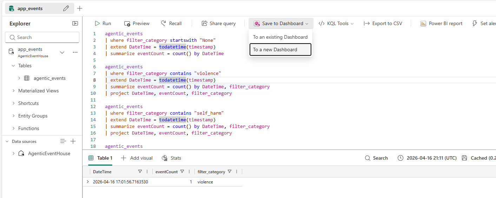
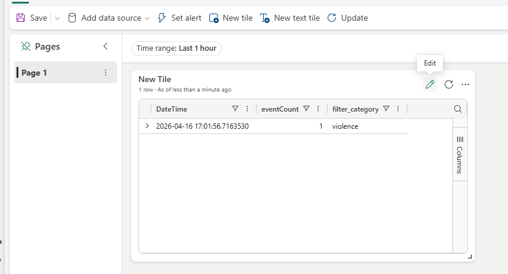

# ⚗️ Explore Fabric Workloads

← [Back to README](../README.md)

This guide walks you through the Fabric-side features of the app after it is running. Each section is independent — do them in any order.

---

## Table of Contents

- [Real-Time Monitoring (RTI)](#-real-time-monitoring-rti)
- [Agentic Analytics (Power BI)](#-agentic-analytics-power-bi)
- [Fabric Data Agent](#-fabric-data-agent)
- [Agent Performance Evaluation (Notebook)](#-agent-performance-evaluation-notebook)

---

## 📡 Real-Time Monitoring (RTI)

As the app runs, it streams content safety and usage events to Fabric Eventstream → Eventhouse (KQL). Follow these steps to complete the pipeline and enable the real-time dashboard.

### Step 1 — Launch the App and Do at Least One Test Chat 

The Eventstream needs at least one data event to infer the incoming schema before you can configure the destination.

Run the app, log in, and send any message in the chat.

---

### Step 2 — Connect the Eventhouse to the Eventstream

1. In your Fabric workspace, open **agentic_stream** (the Eventstream artifact).

   

2. Click the **agentic_stream** node → click **Refresh** → confirm at least one row of data is visible.

   

3. The Eventhouse destination will show as **Unconfigured**. Click **Configure**, click on **new table** and name it **agentic_events**, then follow below steps to finalize:

   
   
   

4. Click **Close**, then click **Edit** (top right) → **Publish**.

   
   

---

### Step 3 — Verify Data is Flowing

Send another test chat, then open the **app_events** KQL Database in your workspace. It may take a few minutes on first run.


---

### Step 4 — Build the Real-Time Dashboard

1. Open **QueryWorkBench** in your workspace and paste below queries there:

   ```query
   agentic_events

   | where filter_category startswith "None"

   | extend DateTime = todatetime(timestamp)

   | summarize eventCount = count() by DateTime

    

   agentic_events

   | where filter_category contains "violence"

   | extend DateTime = todatetime(timestamp)

   | summarize eventCount = count() by DateTime, filter_category

   | project DateTime, eventCount, filter_category

    

   agentic_events

   | where filter_category contains "self_harm"

   | extend DateTime = todatetime(timestamp)

   | summarize eventCount = count() by DateTime, filter_category

   | project DateTime, eventCount, filter_category

    

   agentic_events

   | where filter_category contains "hate"

   | extend DateTime = todatetime(timestamp)

   | summarize eventCount = count() by DateTime, filter_category

   | project DateTime, eventCount, filter_category

    

   agentic_events

   | where filter_category contains "jailbreak"

   | extend DateTime = todatetime(timestamp)

   | summarize eventCount = count() by DateTime, filter_category

   | project DateTime, eventCount, filter_category

    

    

   agentic_events

   | summarize total_count = count()

   ```
2. If you click on any of them and Run, you can see the results.

3. Now is the time to build your first real-time monitoring dashboard. Click on a query of your choice, then click on the "Save to Dashboard" drop down. Since this is a new dashboard, click on "**To a new Dashboard** option and choose a name you desire (ex. ContentMonitoring)

   :


4. Now you can open your dashboard and see the first panel that you just added:

   

   You can click on edit and modify the name, type of visualization, etc.

5. You can follow the same approach and add other queries to the same dashboard (or  a new one, if you desire.


> 💡 **Test tip:** To simulate sensitive content without triggering real OpenAI filters, type a filter category name (e.g. `violence`, `jailbreak`) directly into the chat.

---

## 📊 Agentic Analytics (Power BI)

As the app is used, operational data flows automatically through the pipeline:

```
agentic_app_db (SQL Database)
       ↓
agentic_lake (Lakehouse)
       ↓
banking_semantic_model (Semantic Model)
       ↓
Agentic_Insights (Power BI Report)
```

Open **Agentic_Insights** in your workspace to explore agent performance, usage patterns, and SQL workload metrics. The report refreshes as you use the app — no manual refresh needed.

---

## 🤖 Fabric Data Agent

The **Banking_DataAgent** gives the app a read-only, natural-language interface to the banking data warehouse. It is deployed and can be used via setting the environment variable **USE_FABRIC_DATA_AGENT** to "true".

### Verify the Data Agent is Connected

The deployment script sets these three variables in `backend/.env` automatically:

```dotenv
USE_FABRIC_DATA_AGENT="true"
FABRIC_DATA_AGENT_SERVER_URL="https://api.fabric.microsoft.com/v1/workspaces/.../dataAgents/.../run"
FABRIC_DATA_AGENT_TOOL_NAME="Banking_DataAgent"
```

### Set up Data Agent
[Set up Data Agent as an expert database agent!](../workshop/Data_Agent/data_agent_configuration_reference.md)

---

## 🧪 Agent Performance Evaluation (Notebook)

The **QA_Evaluation_Notebook** in your workspace computes four quality scores for agent responses using [Azure AI Evaluation](https://learn.microsoft.com/en-us/azure/ai-foundry/how-to/develop/agent-evaluate-sdk):

| Score | What it measures |
|---|---|
| Intent Resolution | Did the agent understand the user's goal? |
| Relevance | Is the response relevant to the question? |
| Coherence | Is the response logically structured? |
| Fluency | Is the response well-written? |

### Setup

1. Create a `.env` file with your judge LLM credentials:

   ```dotenv
   AZURE_OPENAI_KEY="your key"
   AZURE_OPENAI_ENDPOINT="your model endpoint"
   AZURE_OPENAI_DEPLOYMENT="model name"
   AZURE_OPENAI_API_VERSION="api version"
   ```

2. Upload this `.env` file to the **Files** section of the notebook page in Fabric (found under Built-in in the Resources tab).

3. Open **QA_Evaluation_Notebook** in Fabric and run all cells in order.

After a successful run, a new table called **answerqualityscores_withcontext** appears in **agentic_lake** with all evaluation scores.
