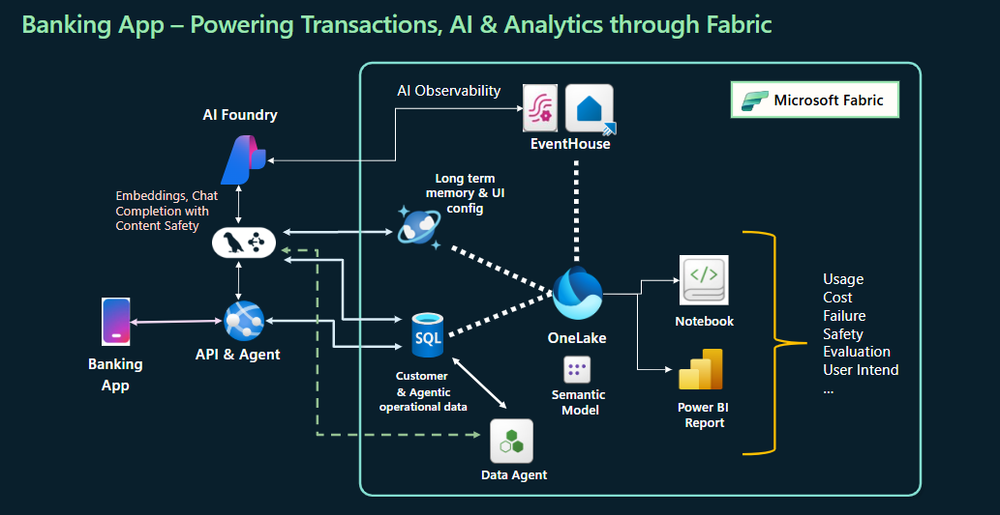

# 🧑‍💻 Learn More

← [Back to README](../README.md)

This guide explains how the app works under the hood and points to resources for going deeper.

---

## Table of Contents

- [Architecture Overview](#-architecture-overview)
- [How the Multi-Agent System Works](#-how-the-multi-agent-system-works)
- [SQL Workload Types Demonstrated](#-sql-workload-types-demonstrated)
- [How Data Flows Through Fabric](#-how-data-flows-through-fabric)
- [Embeddings and RAG](#-embeddings-and-rag)
- [Workshop Content](#-workshop-content)
- [Contributing](#-contributing)

---

## 🏗️ Architecture Overview



### Tech Stack

| Layer | Technology |
|---|---|
| Frontend | React, Vite, TypeScript, Tailwind CSS |
| Backend | Python, Flask, LangChain, LangGraph |
| Databases | Fabric SQL Database, Fabric Cosmos DB |
| Analytics | Fabric Lakehouse, Semantic Model, Power BI |
| Streaming | Fabric Eventstream, Eventhouse, KQL Database |
| AI | Azure OpenAI (GPT + embeddings) |
| Data Agent | Fabric Data Agent (MCP) |

### Key Design Decisions

- **Single SQL database, three workload types** — `agentic_app_db` handles both OLTP (transactions, account writes) as well as OLAP, also and stores the AI operational data (chat history, agent traces).
- **Fabric as the data platform** — rather than managing separate Azure resources, all storage, streaming, analytics, and AI artifacts live in one Fabric workspace and share a common identity model.
- **Separation of services** — the backend runs two Flask services: one for the banking app (`5001`) and one for the agent analytics pipeline (`5002`). This keeps operational data capture independent of user-facing latency.

---

## 🤖 How the Multi-Agent System Works

The backend uses **LangGraph** to orchestrate a team of five specialized agents:

```
User Message
     │
     ▼
┌─────────────────┐
│  Coordinator    │  Reads intent, routes to the right agent
└────────┬────────┘
         │
    ┌────┴──────────────────────────────────┐
    │                                       │
    ▼                                       ▼
┌─────────┐  ┌──────────┐  ┌──────────┐  ┌────────────────┐
│ Support │  │ Account  │  │   Data   │  │ Visualization  │
│  Agent  │  │  Agent   │  │  Agent   │  │     Agent      │
└─────────┘  └──────────┘  └──────────┘  └────────────────┘
   RAG over    OLTP ops      Fabric Data    Generates custom
   PDF docs    (read/write   Agent (MCP,    UI components
               SQL)          read-only)     + saves to DB
```

### Agent Descriptions

| Agent | Responsibility | Data Access |
|---|---|---|
| **Coordinator** | Classify intent, route to specialist | None |
| **Support** | Answer general banking questions | RAG over PDF documents (embeddings in SQL DB) |
| **Account** | Balance, transfers, new accounts | Read/write to `agentic_app_db` via ODBC |
| **Data** | Complex analytical queries in natural language | Fabric Data Agent → Lakehouse (read-only) |
| **Visualization** | Generate personalized charts and simulations | Reads/writes `gen_ui_config` in Cosmos DB |

### Try These Scenarios

- *"What is my balance?"* → Account Agent (OLTP read)
- *"Transfer $200 to my savings account"* → Account Agent (OLTP write)
- *"How much did I spend on food last quarter?"* → Data Agent (OLAP via Fabric)
- *"Show me a spending breakdown chart"* → Visualization Agent (Generative UI)
- *"What documents do I need to open a new account?"* → Support Agent (RAG)

---

## 🗄️ SQL Workload Types Demonstrated

One of the main learning goals of this demo is to show how a single SQL-based data platform handles fundamentally different workload types:

### OLTP (Online Transaction Processing)
- **What:** Fast, atomic reads and writes — individual transactions, balance checks, account creation
- **In the app:** The "Transfer Money" and "Transactions" tabs
- **In Fabric:** Direct ODBC writes to `agentic_app_db` SQL Database

### OLAP (Online Analytical Processing)
- **What:** Complex aggregations over large datasets — spending by category, monthly trends
- **In the app:** The "Financial Analytics" tab and natural-language queries via the Data Agent
- **In Fabric:** Lakehouse SQL views → `banking_semantic_model` → Power BI / Data Agent

### AI Workload
- **What:** Vector similarity search for RAG, storing/retrieving agent traces and chat sessions
- **In the app:** Support agent responses, conversation memory, evaluation scores
- **In Fabric:** `agentic_app_db` (chat_history, agent_traces, DocsChunks_Embeddings tables)

---

## 🔄 How Data Flows Through Fabric

```
App Usage (chat, transactions)
         │
         ├──► agentic_app_db (SQL Database)
         │         │  OLTP writes (accounts, transactions, chat sessions, agent traces)
         │         │
         │         ▼
         │    agentic_lake (Lakehouse)
         │         │  Shortcuts mirror SQL DB tables
         │         │  SQL views transform raw data
         │         │
         │         ▼
         │    banking_semantic_model → Agentic_Insights (Power BI)
         │
         └──► Fabric Eventstream (real-time)
                   │  Content safety + usage events
                   │
                   ▼
              app_events (KQL Database in Eventhouse)
                   │
                   ▼
              ContentSafetyMonitoring (Real-time Dashboard)
```

### Cosmos DB Role

`agentic_cosmos_db` stores two collections:

| Container | Purpose |
|---|---|
| `gen_ui_config` | Saves generated visualization configs per user — so custom charts persist across sessions |
| `longterm_memory` | Stores conversation history per session for context-aware responses |

---

## 📄 Embeddings and RAG

The Support Agent answers general banking questions using Retrieval-Augmented Generation (RAG) over PDF documents. Embeddings are pre-computed and stored in the `DocsChunks_Embeddings` table in `agentic_app_db`.

### How Embeddings Were Created

The script `Data_Ingest/Ingest_pdf.py` chunks PDFs, generates embeddings via `text-embedding-ada-002`, and inserts them into the SQL database.

> ⚠️ Embeddings are already ingested in the deployed database. Running this script again will create duplicates.

### Run It Yourself (Optional)

```bash
# Copy your .env into the Data_Ingest folder
cp backend/.env Data_Ingest/.env

# Run from the Data_Ingest folder
cd Data_Ingest
python Ingest_pdf.py
```

---

## 🎓 Workshop Content

The [`workshop/`](../workshop) folder contains self-contained workshop modules for deeper hands-on learning:

| Module | Description |
|---|---|
| `workshop/Data_Agent/` | Build and configure a Fabric Data Agent from scratch |

Each module has its own README with step-by-step instructions.

---

## 💰 Cost Tracking

Every agent invocation records `prompt_tokens`, `completion_tokens`, `model_name`, and `estimated_cost_usd` on the `chat_history` table. The frontend's **Cost Insights** card in the Chat Sessions view shows per-agent and per-model cost breakdowns for the last 7 days.

### Adjusting pricing

Default Azure OpenAI rates live at [`backend/shared/pricing.py`](../backend/shared/pricing.py). Override per-deployment rates by setting `AZURE_OPENAI_MODEL_PRICING_JSON` in `backend/.env`:

```dotenv
AZURE_OPENAI_MODEL_PRICING_JSON={"gpt-4o-mini": {"prompt": 0.00015, "completion": 0.0006}}
```

Rates are USD per 1K tokens. Unknown models fall back to `$0.00` (cost is treated as unavailable, not free).

---

## 🤝 Contributing

Contributions are welcome! Here's how:

1. ⭐ **Star the repo** if you find it useful
2. 🐛 **Report bugs** → [open an issue](https://aka.ms/AgenticAppFabric)
3. 💡 **Suggest features** → open a discussion or issue
4. 🔧 **Submit a pull request** → fork, branch, and PR against `main`

Please follow existing code style and include a clear description of what your change does and why.
