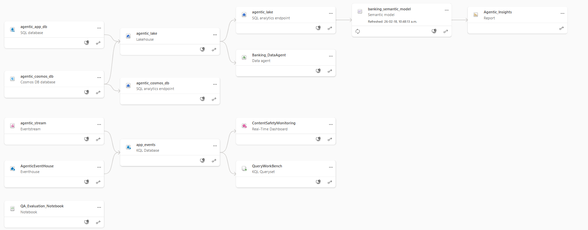

### Deploy all required Fabric artifacts via Git integration feature in your workspace 

#### 1. Set up your repo
- Clone this repo: navigate to the repository on GitHub and click the "Code" button. Copy the URL provided for cloning.
- Open a terminal window on your machine and run below:

```bash
git clone https://github.com/Azure-Samples/agentic-app-with-fabric.git
cd agentic-app-with-fabric  # root folder of the repo
```
- Create a **private** repo in your Github account, with the same name. Since you will be adding sensitive credentials, **repo must be private**.
- Go back to terminal (you should be in the root folder of the repo you cloned) and push the content to your private repo by running below:

```bash
 git push https://github.com/[replace with you git username]/[replace with your repo name].git
```
#### 2. Set up your Fabric account

- If you do not already have access to a Fabric capacity, you can easily enable a Microsoft Fabric trial capacity for free which will give you free access for 60 days to all features needed for this demo: https://learn.microsoft.com/en-us/fabric/fundamentals/fabric-trial

- In Home tab of your Fabric account (with Welcome to Fabric title), click on "New workspace" and proceed to create your workspace for this demo.

#### 3. Automatic set up of all required Fabric resources and artifacts 
To easily set up your Fabric workspace with all required artifacts for this demo, you need to link your Fabric workspace with your repo. 

You only need to do below steps one time.

##### Step 1: Set up your database in Fabric

1. In Fabric, go to your workspace and click on "Workspace settings" on top right of the page.
2. Go to Git integration tab -> Click on GitHub tile and click on "Add account"
3. Choose a name, paste your fine grained personal access token for the private repo you just created (don't know how to generate this? there are a lot of tutorials online such as: https://thetechdarts.com/generate-personal-access-token-in-github/)
4. paste the repo url and connect
5. After connecting to the repo, you will see the option in the same tab to provide the branch and folder name. Branch should be "main" and folder name should be "Fabric_artifacts"
    - Click on "Connect and Sync" 
    - Now the process of pulling all Fabric artifacts from the repo to your workspace starts. This may take a few minutes. Wait until all is done (you will see green check marks)
    
##### Step 2: Re-deploy to connect semantic model to the right database endpoint

- In the first step, data artifacts were deployed, but the semantic model needs to be redeloyed by provding the correct database endpoint parameters which you would need to obtain and provide manually as below:
1. **Go to agentic_lake's SQL analyitc endpoint**, and Obtain below values (copy and keep somewhere)

    - **SQL server connection string**: First, go to the **SQL analytics endpoint** of the **agentic_lake**, go to settings -> SQL endpoint -> copy value under SQL connection string  (paste it somewhere to keep it for now)
    - **Lakehouse analytics GUID**: Look at the address bar, you should see something like this: *https://app.fabric.microsoft.com/groups/[first string]/mirroredwarehouses (or lakehouses)/**[second string]**?experience=fabric-developer*
        - copy the value you see in position of second string. 
        

2. Now in your private Git repo, go to: **Fabric_artifacts\banking_semantic_model.SemanticModel\definition**, open the file called **expressions.tmdl** and replace the values with the ones you just retrieved. *Save the file and commit/push it to your repo*.


3. Now go back to your Fabric workspace and trigger an update via Source Control

4. This will start to set up the connection between lakehouse's SQL analytics endpoint and the semantic model and  may take 1-2 minutes. Below shows how your data lineage view should look like after this is done. 

    

#### 4. *** IMPORTANT!!: Add extra views to Lakehouse's SQL analytics endpoint ***

The initial application data will be automatically populated, if not existing, in the SQL Database when you start the backend application. So you do not need to do any extra steps to ingest data. But for the Power BI reporting layer, we need to add some extra views.

**Add views to the SQL Analytics endpoint**
- Go to the **SQL analytics** endpoint of your **agentic_lake**:

    
- Go to **Data_Ingest** folder and run all 3 queries that you see in file **views.sql**:

    

After above steps are done, below is what you should see in the lineage view of your workspace:

