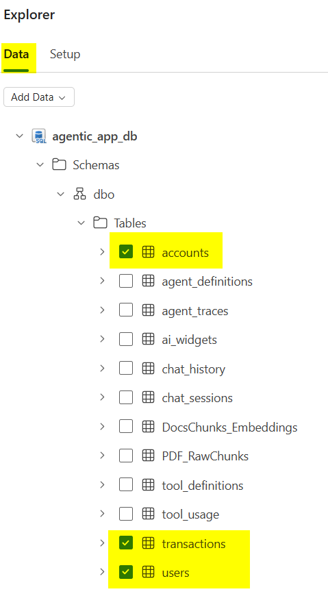

# Fabric Data Agent Configuration Reference

This document is a reference for the workshop's **Banking_DataAgent**. It separates what belongs in the **overall Data Agent description**, **Data Agent-level instructions**, **schema selection**, **data source instructions**, and **few-shot examples**.


---

## 1. Data Agent Description

Use this in the **Data Agent description** field, not in the Data Source instructions field.


```text
Banking_DataAgent is a read-only analytics assistant for the workshop banking app. It answers natural-language questions about account balances, recent transactions, spending by category, income vs. expenses, and other financial summaries by querying the banking data model in Microsoft Fabric. The agent should be used for analysis only, not for transfers, account creation, or any other write operation.
```

### What this description should do

- Tell the user what the agent is for
- Make the read-only behavior explicit
- Keep the description high-level and task-oriented
- Avoid schema details or SQL guidance

---

## 2. Data Agent Instructions

Use this in the **Data Agent AI instructions** field. Keep this section limited to behavior that applies across the whole agent.

```md
## Role
You are Banking_DataAgent, a read-only financial analytics assistant for the workshop banking app.

## Coverage
Answer questions about account balances, account summaries, recent transactions, spending, deposits, income vs. expenses, category breakdowns, and high-level trends across the banking dataset.

## Response Format
Lead with the answer. Use short tables or bullets when they make the result clearer. If there is no matching data, say that plainly instead of returning an ambiguous or partial answer.

## Guardrails
Do not create, update, or transfer anything. If a request is a write action, state that this Data Agent is read-only.

## Routing
Use the SQL banking datasource for balances, transactions, categories, and spending questions. Requests about policies or documentation belong to the support agent. Requests to create accounts or move money belong to the account agent.
```

### Example requests this section should support

- "What are the account balances?"
- "Show recent transactions"
- "How much was spent on groceries last month?"
- "What's income vs expenses?"

### Requests this section should not try to solve

- "Transfer $100 to savings"
- "Open a new checking account"
- "What documents do I need to open an account?"

---

## 3. Schema to Select

Select only the three banking tables needed for read-only analytics:

| Table | Select? | Recommended columns |
|---|---|---|
| `dbo.users` | Yes | `id`, `name` |
| `dbo.accounts` | Yes | `id`, `user_id`, `name`, `account_number`, `account_type`, `balance`, `created_at` |
| `dbo.transactions` | Yes | `id`, `from_account_id`, `to_account_id`, `amount`, `type`, `description`, `category`, `status`, `created_at` |



### Important notes

- Exclude unrelated app tables like `agent_traces`, `chat_history`, `tool_usage`, and other non-banking metadata tables.
- The current checked-in datasource already selects `users`, `accounts`, and `transactions`, but it **misses `transactions.description`**, which is important for merchant/payee-style questions.
- `users.email` is optional for this agent and can be omitted to keep the schema tighter.

### Recommended table descriptions

| Table | Description |
|---|---|
| `users` | One row per banking app user. Use `users.id` to link a user to their accounts. |
| `accounts` | One row per account owned by a user. Includes account type, account name, balance, and account number. |
| `transactions` | One row per money movement. Payments usually populate `from_account_id`, deposits usually populate `to_account_id`, and transfers may populate both. |

### Recommended column descriptions

| Column | Description |
|---|---|
| `accounts.user_id` | Foreign key to `users.id`. Use this to join accounts back to the owning user record. |
| `accounts.balance` | Current account balance. Credit account balances may be negative, representing amount owed. |
| `accounts.account_type` | Account category such as `checking`, `savings`, or `credit`. |
| `transactions.from_account_id` | Source account for payments and transfers. Often null for deposits. |
| `transactions.to_account_id` | Destination account for deposits and transfers. Often null for payments. |
| `transactions.type` | Transaction class such as `payment`, `deposit`, or `transfer`. |
| `transactions.description` | Human-readable merchant, payee, payroll, refund, or transfer text. |
| `transactions.category` | Business category used for grouping and filtering. |
| `transactions.status` | Transaction completion state. |
| `transactions.created_at` | Timestamp for sorting recent activity and filtering by time. |

---

## 4. Data Source Instructions

Use this in the **datasource instructions** field for the SQL datasource.

```text
Use only dbo.users, dbo.accounts, and dbo.transactions.

Join rules
- users.id = accounts.user_id
- transactions cannot join directly to users
- For spending and payment questions, join transactions.from_account_id = accounts.id
- For deposit and income questions, join transactions.to_account_id = accounts.id
- For transfer questions, both from_account_id and to_account_id may be populated
- Avoid OR joins between transactions and accounts unless you deduplicate transaction ids; prefer the join path that matches the business question

Business definitions
- Account balances come from accounts.balance
- Credit account balances are usually negative and represent amount owed
- Total spending / expenses = SUM(amount) where transactions.type = 'payment'
- Total income = SUM(amount) where transactions.type = 'deposit'
- Internal transfers are not spending and not income unless the question explicitly asks about transfers
- Recent transactions should be ordered by transactions.created_at DESC
- If filtering by category, prefer exact category matches

Value hints
- account_type values include checking, savings, and credit
- Common payment categories include Groceries, Restaurants, Shopping, Entertainment, Utilities, Transportation, and Healthcare
- Deposit-related categories may include Salary, Refund, and Transfer

Field semantics
- transactions.description is the human-readable merchant or transfer text
- transactions.status indicates completion state
- transactions.from_account_id is often null for deposits
- transactions.to_account_id is often null for payments

If a user uses acronyms or asks ambiguous question, ask for clarification and confirm.
```

### Example questions this section should help answer

- "What is total spending by category?"
- "How much was spent on transportation?"
- "What are the deposits this month?"
- "Show recent transactions"

---

## 5. Few-Shot Examples

Use these in the **few-shot examples** section of the SQL datasource.

### Few-shot 1: Count accounts

**Question**

```text
How many accounts are there?
```

**Query**

```sql
SELECT COUNT(*) AS total_accounts
FROM dbo.accounts;
```

### Few-shot 2: List account balances

**Question**

```text
What are the account balances?
```

**Query**

```sql
SELECT
    a.name,
    a.account_type,
    a.balance,
    a.account_number
FROM dbo.accounts a
ORDER BY a.account_type, a.name;
```

### Few-shot 3: Recent transactions without duplicates

**Question**

```text
Show recent transactions.
```

**Query**

```sql
SELECT TOP 10
    t.id,
    t.amount,
    t.type,
    t.category,
    t.description,
    t.status,
    t.created_at
FROM dbo.transactions t
ORDER BY t.created_at DESC;
```

### Few-shot 4: Spending by category

**Question**

```text
What is total spending by category?
```

**Query**

```sql
SELECT
    t.category,
    COUNT(*) AS num_transactions,
    SUM(t.amount) AS total_amount
FROM dbo.transactions t
WHERE t.type = 'payment'
GROUP BY t.category
ORDER BY total_amount DESC;
```

### Few-shot 5: Exact category match

**Question**

```text
How much was spent on Transportation?
```

**Query**

```sql
SELECT SUM(t.amount) AS total_transportation
FROM dbo.transactions t
WHERE t.type = 'payment'
  AND t.category = 'Transportation';
```

### Few-shot 6: Income vs expenses

**Question**

```text
What's income vs expenses?
```

**Query**

```sql
SELECT
    SUM(CASE
        WHEN t.type = 'payment' THEN t.amount ELSE 0 END) AS total_expenses,
    SUM(CASE
        WHEN t.type = 'deposit' THEN t.amount ELSE 0 END) AS total_income
FROM dbo.transactions t;
```

### Few-shot 7: Top merchants or payees

**Question**

```text
Who are the top merchants?
```

**Query**

```sql
SELECT TOP 5
    t.description,
    COUNT(*) AS transaction_count,
    SUM(t.amount) AS total_spent
FROM dbo.transactions t
WHERE t.type = 'payment'
  AND t.description IS NOT NULL
GROUP BY t.description
ORDER BY total_spent DESC;
```

### Few-shot 8: Total balance across accounts

**Question**

```text
What is the total balance across all accounts?
```

**Query**

```sql
SELECT SUM(balance) AS total_balance
FROM dbo.accounts;
```

---

## 6. Example Questions to Try

Try these in the app after the Data Agent is updated:

1. "What are the account balances?"
2. "Show recent transactions"
3. "What is total spending by category?"
4. "How much was spent on groceries last month?"
5. "How much was spent on Transportation?"
6. "What's income vs expenses?"
7. "Who are the top merchants?"
8. "What is the total balance across all accounts?"
